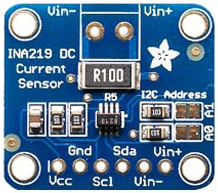

# pimatic-ina219

Pimatic plugin for the INA219 current and power i2c sensor 

This plugin makes an ina219 based device available in Pimatic. The Ina219 device is connected via the I2C port of your computer.
The plugin is tested on a raspberry pi.

The plugin can be installed via the plugins page of Pimatic.

## Config of the plugin
```
{
  debug: "Debug mode. Writes debug messages to the Pimatic log, if set to true."
}
```

## Config of an Ina219 Device

After installation of the plugin (and restart) devices can be added via the devices pages in Pimatic.

Device configuraton:

```
{
 device: "Device number to use (prefix /dev/i2c- is automatically added)"
   default: 1
 address: "Address of the sensor"
   enum: [0x40,0x41,0x44,0x45]
   default: 0x40
 interval: "Sensor read interval in ms"
   default: 10000
}
```

The Ina219 provides 2 attributes
- Voltage (V)
- Current (A)

The attributes are updated and visible in the Gui every \<interval\> milliseconds.


---
This plugin is based on the Ina219 library from [brettmarl](https://github.com/brettmarl/node-ina219#readme).

The minimum node requirement for this plugin is node v8!
